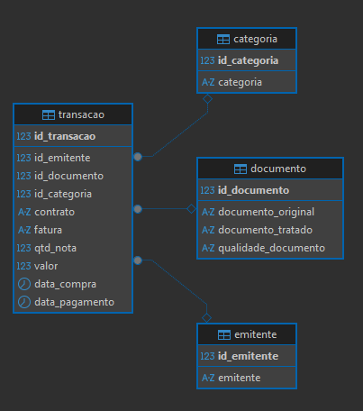

# Neoway Data Pipeline API

API desenvolvida em Django para ingestão e processamento de dados via um pipeline de ETL assíncrono. O projeto utiliza a arquitetura Medallion (Bronze, Silver, Gold) para organizar os dados no PostgreSQL.

## Funcionalidades

- **Upload de Arquivos**: Endpoint para receber arquivos de dados (`.txt`).
- **Processamento Assíncrono**: O pipeline de ETL é executado em uma thread separada, permitindo que a API responda imediatamente.
- **Monitoramento de Status**: Endpoint para consultar o status de um processamento em andamento (`PENDENTE`, `PROCESSANDO`, `CONCLUIDO`, `ERRO`).
- **Pipeline Design Pattern**: A lógica de ETL é estruturada como uma sequência de passos modulares e reutilizáveis, facilitando a manutenção e extensibilidade.
- **Arquitetura Medallion**: Os dados são processados através das camadas `raw` (Bronze), `context` (Silver) e `app` (Gold) no banco de dados.
- **Higienização de Dados**: Aplica tratamentos para remover acentos e padronizar para caixa alta na camada final.
- **Documentação Interativa**: A API é autodocumentada usando Swagger e ReDoc.

## Tecnologias Utilizadas

- **Backend**: Python, Django, Django REST Framework
- **Banco de Dados**: PostgreSQL
- **Containerização**: Docker, Docker Compose
- **Documentação**: drf-yasg (Swagger/OpenAPI)

## Modelo de Dados (Camada Gold)

A camada final (`app`) é modelada seguindo um esquema estrela para otimizar consultas analíticas. O diagrama abaixo ilustra a relação entre a tabela fato e as dimensões.



## Pré-requisitos

- Docker
- Docker Compose

## Desenvolvimento

### Instalação e Execução

Siga os passos abaixo para configurar e executar o ambiente de desenvolvimento localmente.

1.  **Clone o repositório:**
    ```sh
    git clone <url-do-seu-repositorio>
    cd neoway
    ```

2.  **Crie o arquivo de ambiente:**
    Copie o arquivo de exemplo `.env.example` para um novo arquivo chamado `.env`.
    ```sh
    # No Windows (Command Prompt)
    copy .env.example .env
    
    # No Linux ou macOS
    cp .env.example .env
    ```
    **Importante:** Edite o arquivo `.env` e preencha a variável `DJANGO_SECRET_KEY` com um valor seguro.

3.  **Inicie os serviços com Docker Compose:**
    Este comando irá construir as imagens, criar os contêineres e iniciar todos os serviços.
    ```sh
    docker-compose up --build
    ```
    O servidor da API estará disponível em `http://localhost:8000`.

### Testes

O projeto possui uma suíte de testes automatizados utilizando `pytest` e `pytest-django` para garantir a qualidade e a estabilidade do código. A pasta `pipeline/tests` contém todos os arquivos de teste, que cobrem a lógica do pipeline de ETL, os serializers e as views da API.

Para executar os testes localmente, certifique-se de que as dependências de desenvolvimento estão instaladas e execute o seguinte comando na raiz do projeto:

```sh
pytest
```

## Como Usar a API

### 1. Endpoint de Upload

Envie o arquivo `.txt` para iniciar o processamento.

- **URL**: `http://localhost:8000/api/upload/`
- **Método**: `POST`
- **Corpo**: `form-data` com a chave `file` contendo o arquivo.

**Exemplo com `curl`:**
```bash
curl -X POST -F "file=@caminho/para/seu/base_ficticia_dados_prova.txt" http://localhost:8000/api/upload/
```

**Resposta de Sucesso (202 Accepted):**
```json
{
    "id": 1,
    "nome_arquivo": "base_ficticia_dados_prova.txt",
    "status": "PENDENTE"
}
```
Guarde o `id` retornado para consultar o status.

### 2. Endpoint de Status

Consulte o andamento do processamento do arquivo.

- **URL**: `http://localhost:8000/api/status/<id_do_arquivo>/`
- **Método**: `GET`

**Exemplo com `curl`:**
```bash
curl http://localhost:8000/api/status/1/
```

**Resposta de Sucesso (200 OK):**
```json
{
    "id": 1,
    "nome_arquivo": "base_ficticia_dados_prova.txt",
    "status": "CONCLUIDO",
    "data_recebimento": "2025-09-08T14:10:00.123Z",
    "data_inicio_processamento": "2025-09-08T14:10:01.456Z",
    "data_fim_processamento": "2025-09-08T14:11:30.789Z",
    "tempo_processamento": "0:01:29.333000",
    "detalhes_erro": null
}
```

### Documentação Interativa

A API pode ser explorada e testada diretamente pelo navegador através das seguintes URLs:

- **Swagger UI**: `http://localhost:8000/swagger/`
- **ReDoc**: `http://localhost:8000/redoc/`

## Integração Contínua (CI) 

GitHub Actions foram utilizadas para a Integração Contínua. O workflow, definido no arquivo .github/workflows/django-ci.yml, é acionado a cada push ou pull request para a branch main.
O pipeline de CI realiza as seguintes etapas: 
* Configura o ambiente com Python e um banco de dados PostgreSQL de serviço. 
* Instala todas as dependências do projeto a partir do requirements.txt. 
* Executa a suíte de testes completa com pytest. 

Isso garante que todas as alterações sejam validadas automaticamente, mantendo a integridade da base de código.

